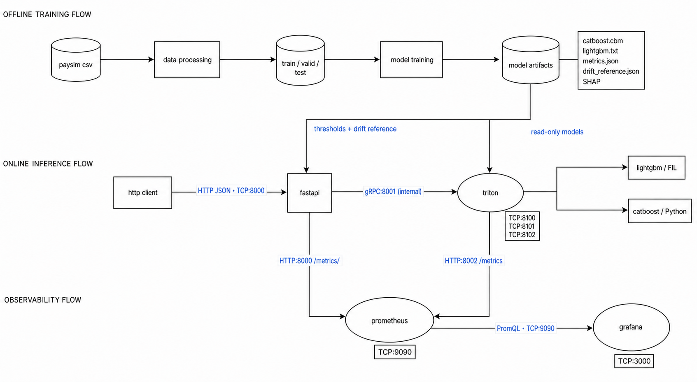
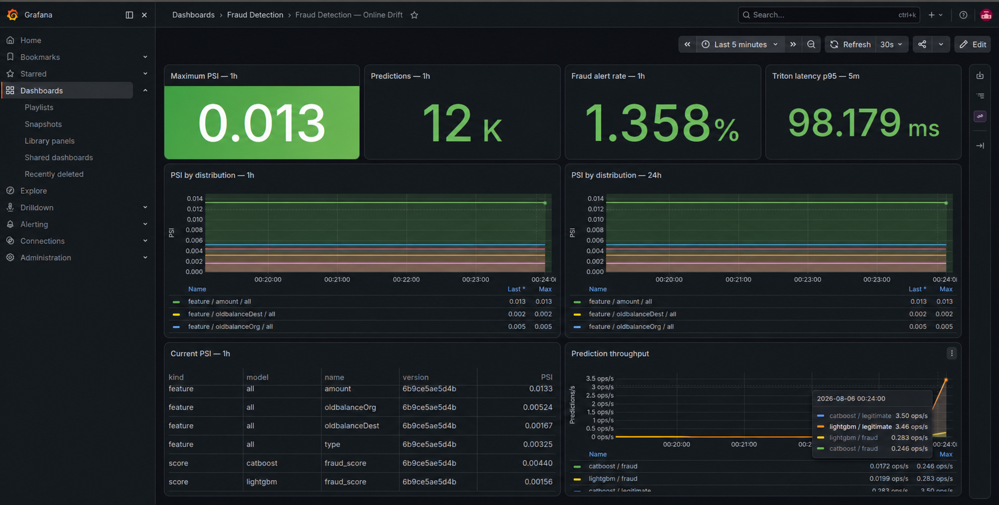
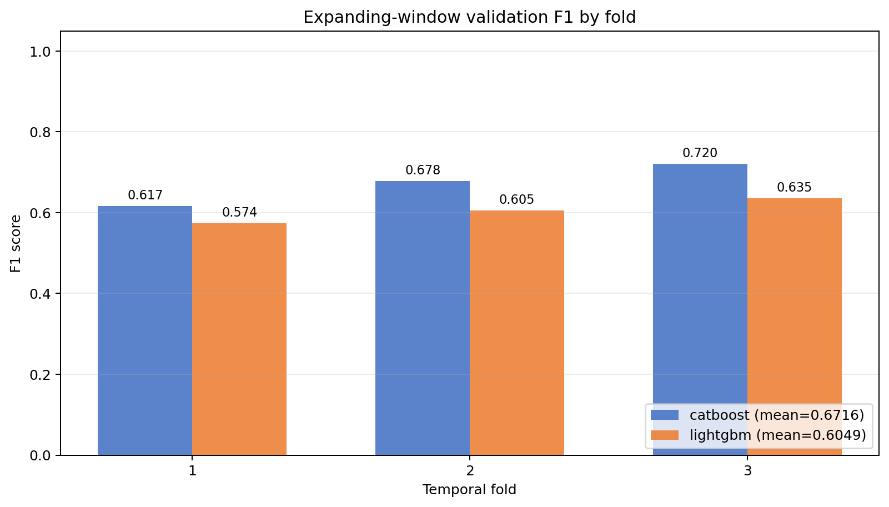
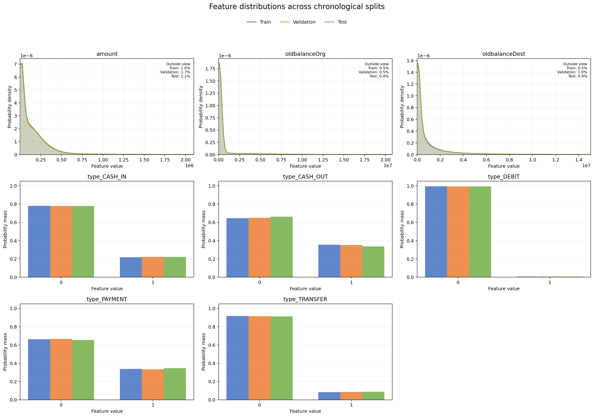
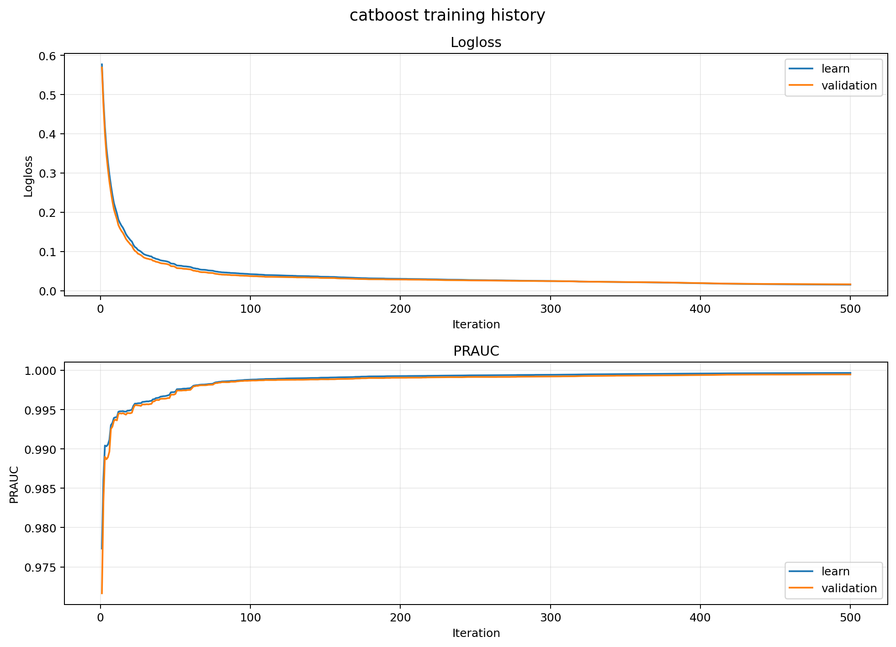
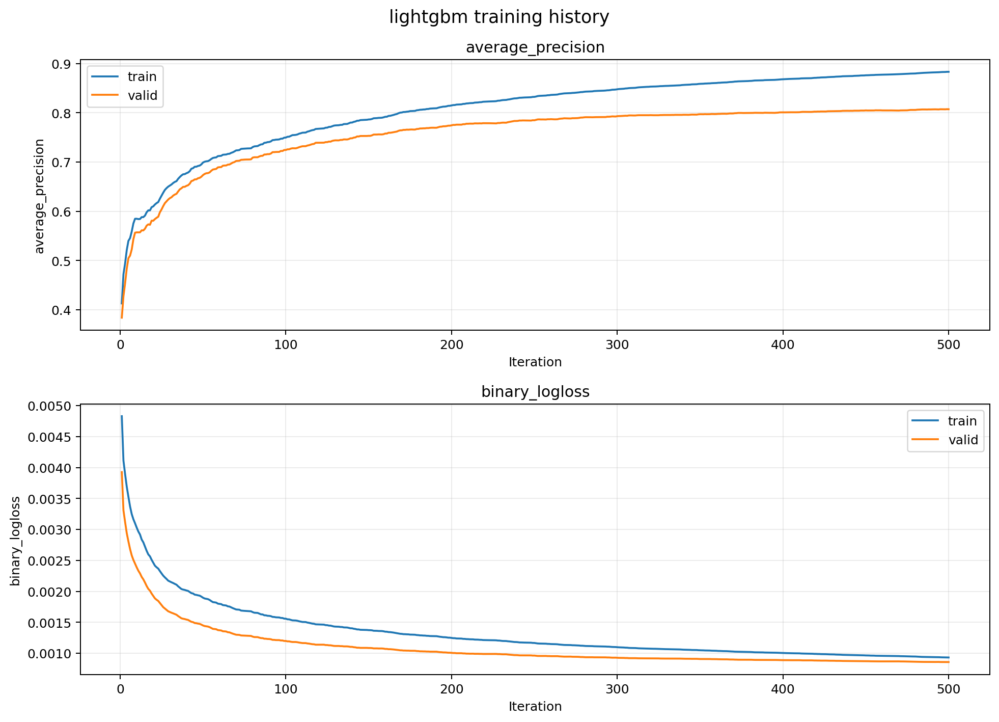
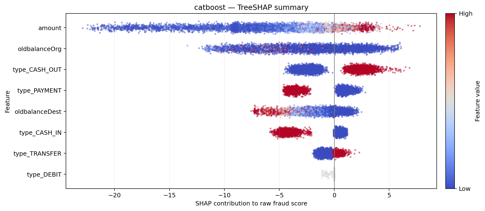
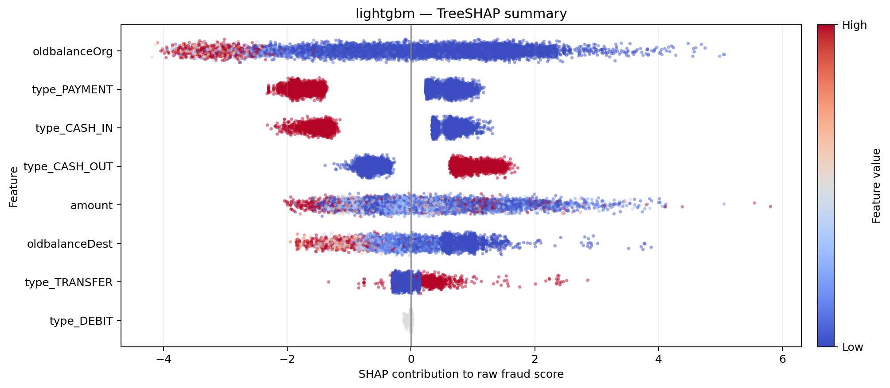

# Fraud Detection

This project started as a fraud classification baseline and grew into a small,
end-to-end machine learning system. The goal is not only to train a model on
PaySim, but also to serve it through a stable API, monitor its inputs and
scores, explain its decisions, and keep the whole workflow reproducible.

The repository contains two gradient boosting models, a FastAPI service,
NVIDIA Triton inference, online drift monitoring, structured logs, tests, and
a GitHub Actions pipeline. Everything runs on CPU by default. GPU support is an
optional Compose override.



The Grafana dashboard is provisioned with the stack and shows live PSI,
prediction traffic, fraud alert rate, and Triton latency.

## Model results at a glance

### Temporal cross-validation

The current Optuna study uses three expanding time windows with a one-step
gap. Both models were evaluated on exactly the same validation periods. The
final 15 percent test period was excluded from tuning.

| Model | Best trial | Completed trials | Mean AP | Mean F1 | F1 standard deviation |
| --- | ---: | ---: | ---: | ---: | ---: |
| CatBoost | 2 | 5 | 0.8205 | 0.6716 | 0.0426 |
| LightGBM | 2 | 7 | 0.7929 | 0.6049 | 0.0249 |

| Fold | Validation steps | CatBoost F1 | LightGBM F1 |
| --- | --- | ---: | ---: |
| 1 | 97 to 190 | 0.617 | 0.574 |
| 2 | 191 to 284 | 0.678 | 0.605 |
| 3 | 285 to 378 | 0.720 | 0.635 |



CatBoost leads on both mean Average Precision and mean F1 in this study.
F1 increases on later folds for both models, but an expanding window also gives
each later fold more training history. The improvement may come from the larger
training set, a different temporal mix, or both. It does not prove that model
quality improves over time. This snapshot belongs to DVC data version
`e92a5f7447f43712f1dca473d0b0fa85`.

### Feature distributions

The chronological train, validation, and test splits have closely aligned
feature distributions. Continuous features use smoothed probability density
curves on a shared scale. Binary one-hot features use probability mass at 0
and 1. The sharp peaks near zero and long right tails are expected for PaySim
transaction amounts and account balances.



### Training curves

CatBoost keeps the training and validation curves close throughout training.
The final model uses the best validation iteration selected by early stopping.



LightGBM shows a wider train and validation gap, but validation average
precision continues to improve through the configured 500 iterations.



### SHAP summaries

The two models do not rank every feature in the same way. CatBoost is driven
primarily by transaction amount, while LightGBM gives more weight to the
source account balance. The horizontal position shows each feature's
contribution to the raw fraud score. Color represents the original feature
value.





## What is included

- Chronological data preparation with separate train, validation, and test sets
- CatBoost and LightGBM training with early stopping
- Optuna hyperparameter tuning with expanding-window validation
- Per-fold F1 reporting and a CatBoost versus LightGBM validation chart
- Threshold selection on validation data with a minimum recall constraint
- PR-AUC, average precision, ROC-AUC, KS, precision, recall, F1, MCC, lift,
  calibration, and error-rate metrics
- Learning curves, evaluation dashboards, feature importance, and TreeSHAP
  plots
- Train, validation, and test feature distribution diagnostics on shared axes
- Single and batch prediction endpoints
- NVIDIA Triton with the FIL backend for LightGBM and the Python backend for
  CatBoost
- Prometheus metrics and a provisioned Grafana dashboard for PSI, traffic,
  alert rate, and inference latency
- Single-line JSON logs with request correlation IDs
- DVC stages for data preparation and model training
- Domain-based tests, coverage checks, linting, type checking, and GitHub CI

## How the system works

The offline path prepares PaySim data, trains both models, selects one decision
threshold per model, and writes versioned artifacts. The online path is kept
separate from training.

For prediction, a client sends JSON to FastAPI. FastAPI validates the request,
builds the eight-feature FP32 tensor, and calls Triton over gRPC. Triton returns
a fraud probability. FastAPI applies the threshold stored in
`artifacts/baseline/metrics.json` and returns both the score and the final
decision.

Prometheus scrapes application metrics from FastAPI and server metrics from
Triton. Grafana reads Prometheus and shows drift, traffic, fraud alert rate,
and latency. Model inputs and transaction balances are not written to logs.

## Technology stack

Data and machine learning:

- Python 3.10
- pandas and NumPy
- scikit-learn metrics and model evaluation utilities
- CatBoost
- LightGBM
- Matplotlib
- Native TreeSHAP through CatBoost ShapValues and LightGBM pred_contrib

API and inference:

- FastAPI
- Pydantic
- Uvicorn
- NVIDIA Triton Inference Server
- Triton FIL backend
- Triton Python backend
- gRPC between FastAPI and Triton
- HTTP and JSON for the public API

Observability and operations:

- Prometheus client metrics
- Prometheus recording and alerting rules
- Grafana dashboards and provisioning
- Population Stability Index monitoring
- Structured JSON logging
- Docker and Docker Compose

Development and MLOps:

- uv for Python environments and locked dependencies
- python-dotenv for local environment configuration
- DVC for pipeline and artifact versioning
- Optuna with TPE sampling, median pruning, and SQLite study storage
- pytest and pytest-cov
- HTTPX with an in-process ASGI transport for API tests
- Ruff
- mypy
- GitHub Actions

## Repository layout

```text
src/data          data validation, transformation, and time-based splitting
src/model         training, Optuna, evaluation, SHAP, Triton, and prediction
src/metrics       reference distributions and online drift metrics
src/web           FastAPI endpoints, schemas, and structured logging
triton_models     Triton model repository and backend configuration
observability     Prometheus rules and Grafana provisioning
tests             tests grouped by data, model, metrics, and web domains
artifacts         trained models, reports, plots, and drift references
data              raw and processed datasets
media             project images used by this README
main.py           file-based batch inference entry point
compose.yaml      default CPU deployment
compose.gpu.yaml  optional GPU override
dvc.yaml          reproducible preparation and training stages
```

## Requirements

You need Docker with the Compose plugin to run the complete service stack.
Training also requires `uv` and Python 3.10 or newer.

The project uses the PaySim file named:

```text
PS_20174392719_1491204439457_log.csv
```

The dataset is not stored in Git. Place it at:

```text
data/raw/PS_20174392719_1491204439457_log.csv
```

## Train the models

Install the locked environment:

```bash
uv sync --locked --all-groups
```

Run the complete DVC pipeline:

```bash
uv run dvc repro
```

The same steps can be run directly when you are working on one stage:

```bash
uv run python -m src.data.process
uv run python -m src.model.baseline
```

The data pipeline sorts transactions by PaySim `step` and creates a 70 percent
train split, a 15 percent validation split, and a 15 percent test split. It
keeps complete time steps together instead of randomly mixing transactions
from different periods.

The model pipeline then:

1. Trains CatBoost and LightGBM with early stopping.
2. Selects the highest-precision validation threshold that still provides at
   least 0.80 recall.
3. Applies that threshold to the untouched test split.
4. Saves models, metrics, learning curves, evaluation plots, feature
   importance, SHAP summaries, split distribution diagnostics, and drift
   reference distributions.

Important outputs are written to `artifacts/baseline`:

```text
catboost.cbm
lightgbm.txt
metrics.json
drift_reference.json
catboost_importance.csv
lightgbm_importance.csv
catboost_shap_importance.csv
lightgbm_shap_importance.csv
plots/
  feature_distributions.png
```

`plots/feature_distributions.png` compares every model input across the
chronological train, validation, and test splits. Continuous features use a
shared density scale and a display range fitted on the central 99 percent of
the training values. Each numeric panel reports the share outside that range.
Binary one-hot features use probability mass at 0 and 1 because a continuous
density is not meaningful for discrete values.

## Tune hyperparameters with Optuna

Optuna tuning is an optional experiment and is not part of the default DVC
pipeline. This keeps `dvc repro` predictable and prevents a normal training run
from starting hours of model search.

Run both studies with the default settings:

```bash
uv run python -m src.model.tuning
```

For a smaller first run, tune LightGBM only:

```bash
uv run python -m src.model.tuning \
  --model lightgbm \
  --trials 10 \
  --folds 3 \
  --gap-steps 1 \
  --timeout 1800
```

The tuner uses expanding-window validation over unique PaySim `step` values.
Complete time steps stay together, a one-step gap separates train and
validation, and the final 15 percent test period is never loaded into an
Optuna fold. The objective is mean average precision across the temporal
validation folds.

With three folds, the training window expands forward in time:

```text
Fold 1: train                    gap  validation
Fold 2: train plus older data   gap  validation
Fold 3: train plus older data   gap  validation
```

For the best trial, the tuner also selects a threshold independently inside
each validation fold using the same production rule: maximize precision while
keeping recall at or above 0.80. It then records F1 for that fold. Average
precision remains the Optuna objective because it is more stable for a highly
imbalanced target and does not depend on one threshold. Fold F1 is a secondary
diagnostic, while the untouched final test split remains the final quality
check.

### Current best parameters

These are the winning values stored in the current `best_params.json`. Values
are rounded here for readability, while the artifact keeps full precision.
Trial counts show the state of the resumable SQLite studies when this snapshot
was exported.

CatBoost:

| Parameter | Best value |
| --- | ---: |
| `learning_rate` | 0.121069 |
| `depth` | 6 |
| `l2_leaf_reg` | 1.855998 |
| `random_strength` | 0.005415 |
| `bagging_temperature` | 1.521211 |
| `class_weight_power` | 0.50 |

LightGBM:

| Parameter | Best value |
| --- | ---: |
| `learning_rate` | 0.036473 |
| `num_leaves` | 47 |
| `max_depth` | 9 |
| `min_child_samples` | 31 |
| `subsample` | 0.716858 |
| `colsample_bytree` | 0.746545 |
| `reg_alpha` | 0.019070 |
| `reg_lambda` | 0.843101 |
| `class_weight_power` | 0.00 |

`class_weight_power` is a project-level parameter rather than a native model
option. A value of zero disables imbalance weighting, while a value of one
applies the full negative-to-positive class ratio.

The selected thresholds are model-specific. Across the three folds they range
from 0.720 to 0.818 for CatBoost and from 0.0887 to 0.0941 for LightGBM. Their
absolute values should not be compared because the models produce differently
calibrated score distributions.

### Optuna search space

CatBoost parameters:

| Parameter | Range | Sampling |
| --- | --- | --- |
| `learning_rate` | 0.01 to 0.20 | Log scale |
| `depth` | 5 to 10 | Integer |
| `l2_leaf_reg` | 1.0 to 30.0 | Log scale |
| `random_strength` | 0.001 to 10.0 | Log scale |
| `bagging_temperature` | 0.0 to 5.0 | Continuous |
| `class_weight_power` | 0.0 to 1.0 | Step 0.25 |

LightGBM parameters:

| Parameter | Range | Sampling |
| --- | --- | --- |
| `learning_rate` | 0.01 to 0.20 | Log scale |
| `num_leaves` | 15 to 127 | Integer |
| `max_depth` | 5 to 12 | Integer |
| `min_child_samples` | 20 to 500 | Log scale integer |
| `subsample` | 0.60 to 1.0 | Continuous |
| `colsample_bytree` | 0.60 to 1.0 | Continuous |
| `reg_alpha` | 0.0001 to 10.0 | Log scale |
| `reg_lambda` | 0.0001 to 10.0 | Log scale |
| `class_weight_power` | 0.0 to 1.0 | Step 0.25 |

The maximum number of trees stays fixed at 500 for both models. Early stopping
selects the effective iteration count independently in every fold.

Optuna uses a seeded TPE sampler. After the configured startup trials, a median
pruner can stop an unpromising trial between temporal folds. Models are tuned
sequentially with one Optuna worker because each tree model already uses all
available CPU cores.

Results are written to:

```text
artifacts/tuning/optuna.db
artifacts/tuning/best_params.json
artifacts/tuning/catboost_trials.csv
artifacts/tuning/lightgbm_trials.csv
artifacts/tuning/temporal_cv_metrics.csv
artifacts/tuning/temporal_cv_f1.png
```

`temporal_cv_metrics.csv` contains Average Precision, F1, the selected
threshold, and time boundaries for every fold. `temporal_cv_f1.png` compares
CatBoost and LightGBM on the same zero to one F1 scale. The actual winning
parameter values and their dataset version are stored in `best_params.json`.

The SQLite database makes each study resumable. Running the command again adds
the requested number of trials to the existing study instead of discarding
previous work.

Train the final baseline with the selected parameters explicitly:

```bash
uv run python -m src.model.baseline \
  --tuned-params artifacts/tuning/best_params.json
```

Without `--tuned-params`, baseline training continues to use the values from
`src/config.py`. The loader rejects unknown fields and non-numeric values. The
effective model configuration is saved in the final `metrics.json` report.

The default search spaces cover learning rate, tree complexity,
regularization, row and column sampling, and class-weight strength. Input
features are not standardized because CatBoost and LightGBM split on ordered
feature values and do not benefit from linear scaling in the same way as
distance-based or linear models.

## Start the application

Copy the local configuration template if you want to change defaults:

```bash
cp .env.example .env
```

Build and start the CPU stack:

```bash
docker compose up --build --detach
docker compose ps
```

Check that Triton and both models are ready:

```bash
curl http://localhost:8000/health
```

Local services are available at:

- FastAPI: `http://localhost:8000`
- OpenAPI: `http://localhost:8000/docs`
- Triton HTTP: `http://localhost:8100`
- Triton gRPC: `localhost:8101`
- Triton metrics: `http://localhost:8102/metrics`
- Prometheus: `http://localhost:9090`
- Grafana: `http://localhost:3000`

All published ports bind to `127.0.0.1`. This is deliberate. The stack should
not be exposed to a public network without authentication, TLS, and a properly
configured reverse proxy.

Stop the stack with:

```bash
docker compose down
```

## Make a prediction

The public request contains values that are available before a transaction is
completed. Post-transaction balances are intentionally not accepted.

```bash
curl -X POST http://localhost:8000/predict/lightgbm \
  -H 'Content-Type: application/json' \
  -d '{
    "type": "TRANSFER",
    "amount": 150000,
    "oldbalanceOrg": 150000,
    "oldbalanceDest": 2000
  }'
```

Example response:

```json
{
  "model": "lightgbm",
  "fraud_score": 0.9931928515,
  "threshold": 0.1005928200,
  "is_fraud": true
}
```

`fraud_score` is the positive-class score returned by Triton. It is bounded
between zero and one, but it should not be treated as a calibrated estimate of
the real-world fraud probability. `threshold` is the model-specific operating
point selected on validation data. Different models can have very different
thresholds, so the score should always be interpreted together with the model
name and its threshold.

Available endpoints:

- `POST /predict` uses the configured default model.
- `POST /predict/batch` scores up to 10,000 transactions with the default model.
- `POST /predict/{model_name}` selects `catboost` or `lightgbm`.
- `POST /predict/{model_name}/batch` scores a batch with the selected model.
- `GET /health` checks Triton and both deployed models.
- `GET /metrics/` exposes Prometheus metrics.

A batch request uses this shape:

```json
{
  "transactions": [
    {
      "type": "PAYMENT",
      "amount": 42.50,
      "oldbalanceOrg": 1000,
      "oldbalanceDest": 0
    },
    {
      "type": "TRANSFER",
      "amount": 150000,
      "oldbalanceOrg": 150000,
      "oldbalanceDest": 2000
    }
  ]
}
```

## Evaluation and explainability

### Test report

Each model gets a test evaluation image with:

- Precision-recall curve and PR-AUC
- ROC curve and ROC-AUC
- KS statistic and KS threshold
- Confusion matrix
- Fraud score distributions
- Precision, recall, and F1 across decision thresholds

The JSON report also contains average precision, balanced accuracy, Matthews
correlation coefficient, specificity, false positive rate, false negative
rate, Brier score, log loss, alert rate, lift, and confusion matrix counts.

TreeSHAP explanations are calculated on a deterministic validation sample.
They are kept in the offline training process so the API does not load another
copy of each model. SHAP values are reported in raw model-score space, which is
the correct additive space for these tree explainers.

## Online drift monitoring

The API records fixed-bin distributions for model features and fraud scores.
The reference distributions are built from validation data during training and
saved in `drift_reference.json`.

Prometheus calculates PSI over one-hour and 24-hour windows. Grafana shows:

- Feature PSI for amount, source balance, destination balance, and transaction
  type
- Score PSI for CatBoost and LightGBM
- Request volume and fraud alert rate
- Triton inference latency
- Monitoring errors and sample counts

The dashboard uses 0.10 as a warning level and 0.25 as a critical level after
at least 5,000 observations in the one-hour window. These are monitoring
signals, not automatic proof that a model has failed.

PSI only detects a distribution change. It cannot measure online precision or
recall without delayed fraud labels. A production system would store prediction
events and join them with confirmed outcomes when those labels become
available.

## Structured logs and security

Every response contains `X-Request-ID`. Application and access logs are emitted
as single-line JSON records with the request ID, model, batch size, status, and
latency. Raw requests and financial values are not logged.

The API validates transaction types, extra fields, finite numeric values,
balance ranges, batch sizes, tensor shapes, and Triton scores. Internal inference
errors are logged and returned to clients as a generic service unavailable
response.

The API container runs as a non-root user with a read-only filesystem, dropped
Linux capabilities, a small temporary filesystem, and `no-new-privileges`.

## CPU and GPU modes

The default Compose file runs both models on CPU and does not require an NVIDIA
GPU. LightGBM uses the Triton FIL backend in CPU mode. CatBoost uses the Triton
Python backend.

On a machine with the NVIDIA Container Toolkit, use the GPU override:

```bash
docker compose -f compose.yaml -f compose.gpu.yaml up --build --detach
```

The same training code can use a GPU by setting:

```bash
FRAUD_TRAIN_DEVICE=gpu
FRAUD_GPU_DEVICES=0
```

## File-based inference

`main.py` uses the same prediction service and Triton gateway as the HTTP API.
Start Triton first, then run:

```bash
uv run python main.py \
  --model lightgbm \
  --input data/processed/fraud_test.csv \
  --output artifacts/baseline/predictions.csv
```

Use `FRAUD_TRITON_GRPC_URL` when Triton is not available at `localhost:8101`.

## DVC workflow

DVC describes two stages in `dvc.yaml`: data preparation and model training.
It tracks stage inputs, outputs, metrics, and content hashes, so Git commits can
refer to exact dataset and artifact versions without storing large files in
Git itself.

This repository currently uses a local DVC remote on the author's machine. A
fresh clone cannot download the PaySim data or trained models from that private
path. To reproduce the project elsewhere, place the raw CSV in `data/raw` and
run `uv run dvc repro`, or configure a shared DVC remote and push the data:

```bash
uv run dvc remote add -d storage <remote-url>
uv run dvc push
```

Once a shared remote is configured, another machine can restore matching files
with `uv run dvc pull`.

Useful DVC commands:

```bash
uv run dvc status
uv run dvc repro
uv run dvc metrics show
uv run dvc diff
```

## Configuration

The most useful environment variables are:

- `FRAUD_MODEL_NAME`: default API model, `lightgbm` or `catboost`
- `FRAUD_TRITON_GRPC_URL`: Triton gRPC address
- `FRAUD_LOG_LEVEL`: application log level
- `FRAUD_ENVIRONMENT`: environment name written to logs
- `FRAUD_TRAIN_DEVICE`: `cpu` or `gpu`
- `FRAUD_GPU_DEVICES`: CatBoost GPU device selection
- `FRAUD_RAW_DATA`: raw PaySim CSV path
- `FRAUD_PROCESSED_DIR`: processed dataset directory
- `FRAUD_ARTIFACT_DIR`: model artifact directory
- `FRAUD_GRAFANA_ADMIN_USER`: local Grafana administrator
- `FRAUD_GRAFANA_ADMIN_PASSWORD`: local Grafana password

Development defaults are stored in `.env.example`. Do not commit real
passwords or deployment secrets to `.env`.

## Tests and continuous integration

Tests are grouped by domain:

```text
tests/data
tests/model
tests/metrics
tests/web
```

Run the same quality checks used by GitHub Actions:

```bash
uv run ruff check .
uv run ruff format --check .
uv run mypy src main.py
uv run pytest --cov --cov-report=term-missing
```

CI installs the locked Python environment, runs linting, formatting, mypy, and
branch-aware coverage with a 70 percent minimum. It also builds the production
API image. Web tests use an in-process ASGI transport, so they do not require
Docker, Triton, or the full PaySim dataset.

## Honest limitations

PaySim is synthetic. Strong offline PR-AUC or KS values show that the models
learn the simulator well, but they do not prove that the same rules will work
on real payment traffic. The current pipeline removes account identifiers,
post-transaction balances, and the simulator fraud flag to reduce obvious
shortcuts, but synthetic patterns can still remain.

Before using this design in a real fraud system, I would add delayed labels,
probability calibration on recent production data, cost-based thresholding,
segment-level monitoring, model versioning in every prediction event, and a
shadow deployment before any automated blocking decision.
